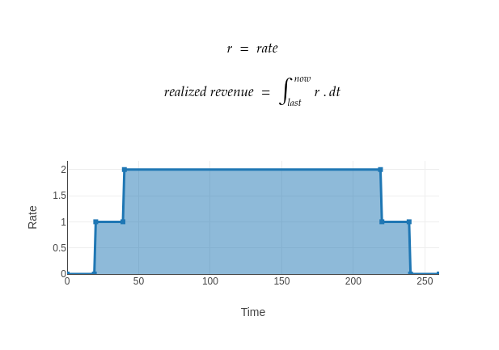

# Radicle Cloud Contract

This contract is responsible for acccounting part of deployments. We need a way to track of when each customer's deployment expires and the amount they have consumed so far.

On Operator side, we need to know how much we've made so far for when we request a withdrawal.

## How it works



The hard part is keeping track of a `rate`, in order to calculate the total revenue for operator. In above picture, we have a user buying at `T=20` (each order lasting for `const 200`) and another user at `T=40`.

This gives us four impact points:
```
t =  20 -> +1
t = 220 -> -1
t =  40 -> +1
t = 240 -> -1
```

Since we don't have an efficient sorted insert in solidity, we track buys and expires separately. This work since buys are chronological by nature (any person purchasing after last person is placing order at a `>=T`). Since we use a fixed duration, expires become chronological as well. Cancel and suspend events are chronological as well. The issue is with renews:

```
org A from t = 20 to t = 220
org B from t = 40 to t = 240

scenario #1. A updates first, then B:
renews = [420, 440]

scenario #2. B updates first, then A:
renews = [440, 420]
```

This breaks it for us. Instead we use a clever optimization where we create `renews` on-fly, whenever we encouner an expire event. When org owner `A` or `B` renew their package, we set `hasUpdate[220]` and `hasUpdate[240]` to true and when we reach those points (in form of expiry points), we append next renew which becomes `420` and `440` respectively, thus restoring the choronologicality.

## Tests

Please install [dapp.tools](https://github.com/dapphub/dapptools) and run the following command to install the dependencies:

```
$ nix-env -f https://github.com/dapphub/dapptools/archive/master.tar.gz -iA solc-static-versions.solc_0_8_7
$ dapp update
```

And finally to run tests:
```
$ dapp test
```

## FAQ

**Question:** What is `rate`?

**Answer:** `rate` is what users pay and operator earns per block.

##

**Question:** Can operator withdraw all funds?

**Answer:** No, they get paid pro-rata. If they stop offering you service, you can withdraw your remaining balance.

##

**Question:** Can operator change price and withdraw funds faster?

**Answer:** No, price changes only affect new orders, meaning new customer or renewals.
